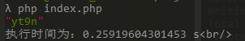

# CAPTCHA_Reader


验证码识别与训练 脚手架

这个项目对验证码识别中常用的 `四个步骤`（~~三个~~）（**获取文件 => 降噪 => 切割 => 识别**）进行了简单的封装，减少开发的复杂程度。并提供了一些现成的解决方案。

> 如果需要最开始的 php 脚本的版本，点这个链接 [master branch](https://github.com/Kuri-su/CAPTCHA_Reader/tree/master)

## 目录结构

```
-root
 |  -docs/                            # readme以及文档相关
 |  -sample/                          # 存放样本图片的文件夹
 |  |  -StudySamples/                 # 学习样本集
 |  |  |  -QinGuo/                    # QinGuo样本集
 |  |  -TestSamples/                  # 测试样本集
 |  |  |  -QinGuo/                    # QinGuo样本集
 |  |  |  |  -0/                      # QinGuo的0号样本集
 |  -src/
 |  |  -Abstracts/                    # 用于装饰器的抽象类
 |  |  -App/                          # 识别用到的类
 |  |  |  -Cutting/                   # 切割类      存放处
 |  |  |  -GetImageInfo/              # 获取图片类  存放处
 |  |  |  -Identify/                  # 识别类      存放处
 |  |  |  -Pretreatment/              # 降噪类      存放处
 |  |  |  -index.php                  # 示例/测试 入口脚本
 |  |  |  -IndexController.php        # 入口类
 |  |  |  -ResultContainer.php        # 结果容器
 |  |  -Config/                       # 配置文件
 |  |  -Dictionary/                   # 字典     存放处 //训练后生成的字典也会放在这里
 |  |  -Log/                          # 日志     存放处
 |  |  -Repositories/                 # 库       存放处
 |  |  -Trait/                        # Trait类  存放处
 |  -training/
 |  |  -Abstracts/                    # 抽象类
 |  |  -AddSamples/                   # 训练类
 |  |  -MultipleTests/                # 测试类
 |  |  -Trait/                        # 设置了计划任务
 |  -composer.json                    # composer 配置文件
```

## 对各种验证码的支持

* **正方教务系统验证码** 已支持，验证码字典样本数为`500条` ，不加上网络延时的耗时在`0.14s - 0.2s`之间，

  > \-
  > 测试集测试的结果
  >
  > `200`个测试样本 中 整体识别正确率 `87%`，单个字母识别正确率率到 `96.5%`

  

* **青果教务系统验证码** 已支持，验证码字典样本数为`200条左右`，不加上网络延时的耗时在 `0.15s - 0.25s`之间

  > \-
  > 测试集测试的结果
  >
  > `200`个测试样本 中 整体识别正确率 `90%`，单个字母识别正确率率到 `96.875%`

  

* **neea.edu.cn** 待支持中
  

* **天翼校园网认证验证码** 待支持中
  


## Examples

`待添加`

## Get Started

**Online 在线**

* 执行 `git clone https://github.com/Kuri-su/CAPTCHA_Reader.git`
* 在根目录下执行`composer update`
* 不用管 `sample`,`training`,`vendor`文件夹, 直接进入 `src/App/index.php` 下，仿照该文件的调用方式即可，例示代码段如下：

```php
  <?php
    //!! 这里的 autoload.php 路径需要自己配置
    require_once(__DIR__ . '/../../vendor/autoload.php');

    use CAPTCHAReader\src\App\IndexController;


    $start_time = microtime(true);//运行时间开始计时

    $indexController = new IndexController();

    $res = $indexController->entrance('http://61.142.33.204/CheckCode.aspx','online');

    dump($res);

    $end_time = microtime(true);//计时停止

    echo '执行时间为：' . ($end_time - $start_time) . ' s' . "<br/>\n";
```

* 运行结果  


**Local 本地**

在识别本地的验证码的模式，代码与上面Online模式相似，只需要调用 `entrance`方法的时候第二个参数传 `local` 即可，例示代码段如下：

```php
<?php

  $start_time = microtime(true);//运行时间开始计时

  require_once(__DIR__ . '/../../vendor/autoload.php');
  use CAPTCHAReader\src\App\IndexController;

  $indexController = new IndexController();

  $res = $indexController->entrance(__DIR__ . '/../../sample/20003.png', 'local');

  dump($res);

  $end_time = microtime(true);//计时停止
  echo '执行时间为：' . ($end_time - $start_time) . ' s' . "<br/>\n
```

## How To Use

### 识别部分

#### 切换识别方案

修改 `src/Config/app.php` 中的 `useGroup`
```php
<?php
    /*
    |--------------------------------------------------------------------------
    | useGroup
    |--------------------------------------------------------------------------
    |
    | 当前使用的模组名
    |
    | 这里的方案名和下面的是一一对应的
    |
    */

    //这里的方案名和下面的是一一对应的
    //青果 QinGuo
    'useGroup' => 'QinGuoNormal' ,
    //正方 zhengfang
    //'useGroup' => 'ZhengFangNormal' ,

    /*
    |--------------------------------------------------------------------------
    | componentGroup
    |--------------------------------------------------------------------------
    | 设定的组件模组
    | components组件的顺序是 获取 图片类-降噪类-切割类-识别类
    | dictionary 对应的是使用的字典
    */

    'componentGroup' => [
        'ZhengFangNormal' => [
            'components' => [
              //如果想改组件类的话可以直接在这里改，但是请依照顺序
                \CAPTCHAReader\src\App\GetImageInfo\GetImageInfo::class ,
                \CAPTCHAReader\src\App\Pretreatment\PretreatmentZhengFang::class ,
                \CAPTCHAReader\src\App\Cutting\CuttingZhengFangFixed::class ,
                \CAPTCHAReader\src\App\Identify\IdentifyZhengFangColLevenshtein::class ,
            ] ,
            'dictionary' => 'GetImageInfo-PretreatmentZhengFang-CuttingZhengFangFixed-IdentifyZhengFangColLevenshtein.json' ,
        ] ,
        'QinGuoNormal' => [
            'components' => [
                \CAPTCHAReader\src\App\GetImageInfo\GetImageInfo::class,
                \CAPTCHAReader\src\App\Pretreatment\PretreatmentQinGuoShrink::class,
                \CAPTCHAReader\src\App\Cutting\CuttingQinGuoShrink::class,
                \CAPTCHAReader\src\App\Identify\IdentifyQinGuoLevenshtein::class,
            ] ,
            'dictionary' => 'GetImageInfo-PretreatmentQinGuoShrink-CuttingQinGuoShrink-IdentifyQinGuoLevenshtein.json' ,
        ] ,
    ];
```

`待补充`

### 训练部分

`待补充`

## 样本集 & 测试集

`待上传`

## Update plan

* :heavy_check_mark: 更有效率的字典训练方法
* :heavy_check_mark: 使代码更加`oop`，更加可复用
* :heavy_check_mark: 增加对青果验证码的支持
* :soon: 增加对 `neea` 的支持
* :soon: 增加对 `天翼校园网认证验证码` 的支持
* :soon: 打包为`composer`包，方便其他项目引用
* **补全文档**
* :clock1230: ~~以`PHP`拓展的方式重写核心函数，降低核心函数的时间复杂度  ~~
* :clock1230: ~~使用 `pthreads` 多线程识别 ~~
* 做完上面几种验证码的就结束支持，挨个支持各个验证码太累了，影响效率的是标记各个验证码，每种最少要标记将近1000个,如果有相关需求的请关注其他神经网络方案(资源消耗并不会多出多少)。
* ~~真是个倒霉孩子把这东西当毕业设计，打码工人累死了~~

## LICENSE

**MIT**