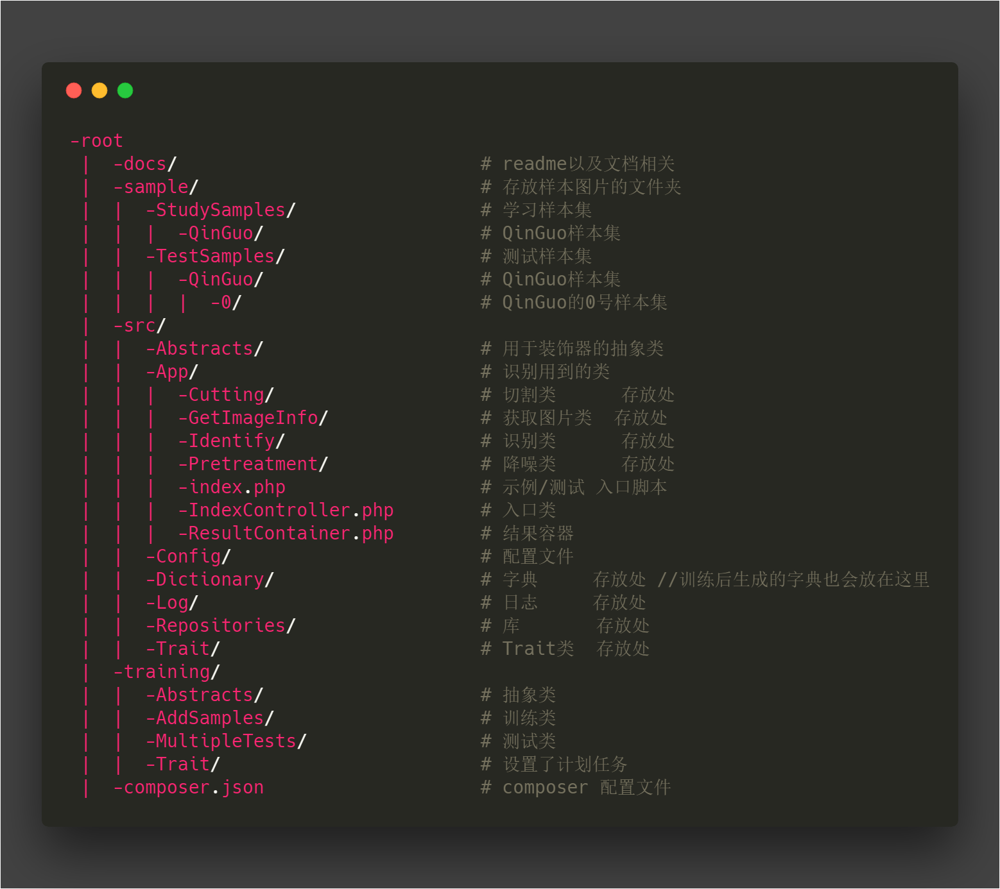
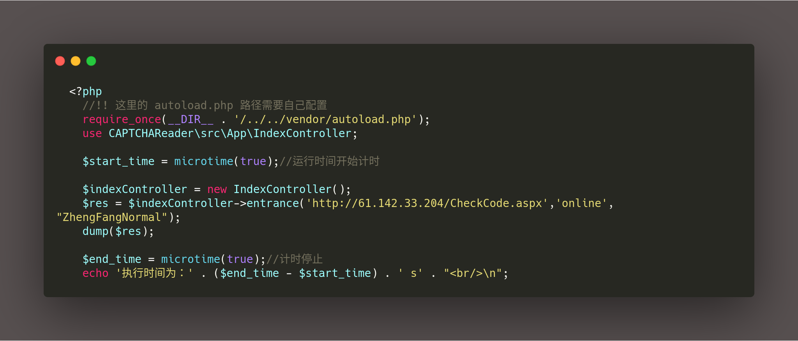
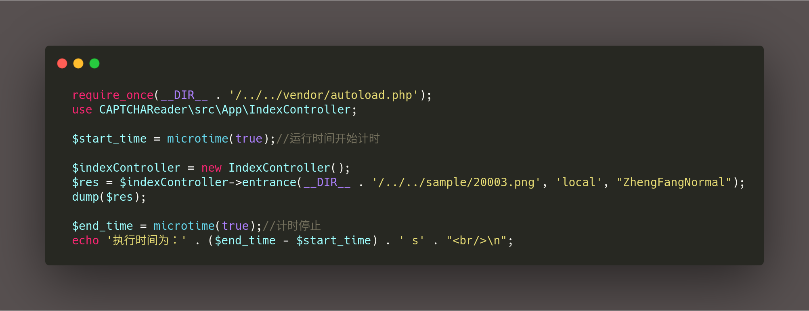
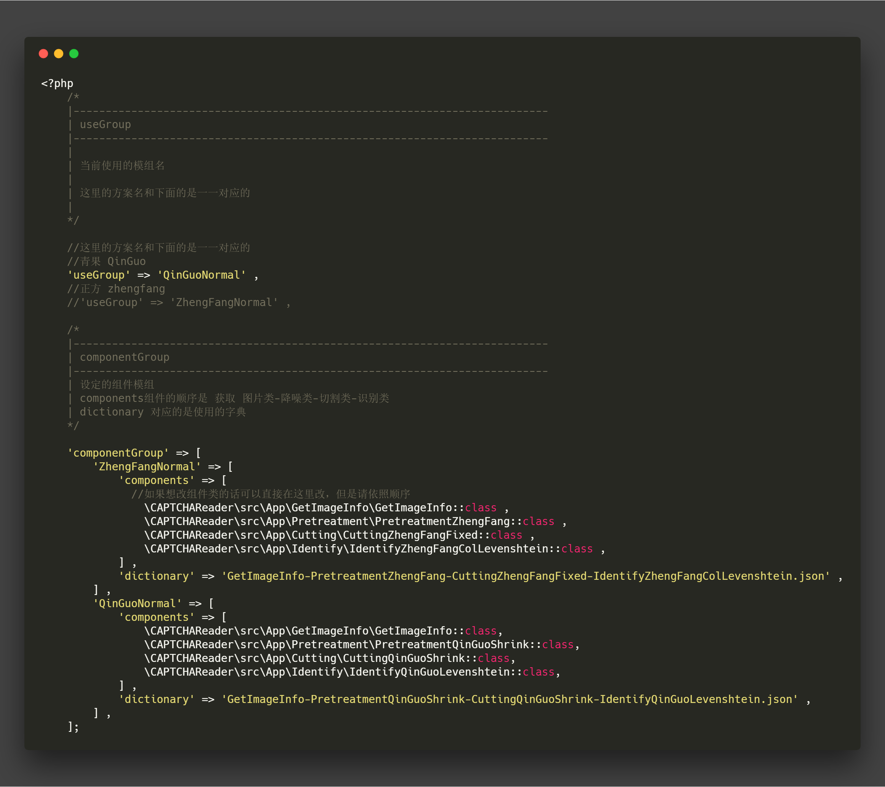

# CAPTCHA_Reader

验证码识别与训练 脚手架

这个项目对验证码识别中常用的 `四个步骤`（~~三个~~）（**获取文件 => 降噪 => 切割 => 识别**）进行了简单的封装，减少开发的复杂程度。并提供了一些现成的解决方案。

> 如果需要最开始的 php 脚本的版本，点这个链接 [master branch](https://github.com/Kuri-su/CAPTCHA_Reader/tree/master)

## 目录结构

## 对各种验证码的支持

* **正方教务系统验证码** 已支持，验证码字典样本数为`500条` ，不加上网络延时的耗时在`0.14s - 0.2s`之间，

  > \-
  > 测试集测试的结果
  >
  > `200`个测试样本 中 整体识别正确率 `87%`，单个字母识别正确率率到 `96.5%`

  

* **青果教务系统验证码** 已支持，验证码字典样本数为`200条左右`，不加上网络延时的耗时在 `0.15s - 0.25s`之间

  > \-
  > 测试集测试的结果
  >
  > `200`个测试样本 中 整体识别正确率 `90%`，单个字母识别正确率率到 `96.875%`

  

* **neea.edu.cn** 待支持中  
  

* **天翼校园网认证验证码** 待支持中  
  

## Examples

`待添加`

## Get started now

**Online 在线**

* 执行 `git clone https://github.com/Kuri-su/CAPTCHA_Reader.git`
* 在根目录下执行`composer update`
* 不用管 `sample`,`training`,`vendor`文件夹, 直接进入 `src/App/index.php` 下，仿照该文件的调用方式即可，例示代码段如下：

> 需要复制可以跳转到 [link](explore.md)

* 运行结果  

**Local 本地**

在识别本地的验证码的模式，代码与上面Online模式相似，只需要调用 `entrance`方法的时候第二个参数传 `local` 即可，例示代码段如下：

> 需要复制可以跳转到 [link](explore.md)

## How To Use

### 识别部分

#### 切换识别方案

修改 `src/Config/app.php` 中的 `useGroup`

`待补充`

### 训练部分

`待补充`

## 样本集 & 测试集

`待上传`

## Update plan

* :heavy_check_mark: 更有效率的字典训练方法
* :heavy_check_mark: 使代码更加`oop`，更加可复用
* :heavy_check_mark: 增加对青果验证码的支持
* :soon: 增加对 `neea` 的支持
* :soon: 增加对 `天翼校园网认证验证码` 的支持
* :soon: 打包为`composer`包，方便其他项目引用
* **补全文档**
* :clock1230: ~~以`PHP`拓展的方式重写核心函数，降低核心函数的时间复杂度~~
* :clock1230: ~~使用 `pthreads` 多线程识别 ~~
* 做完上面几种验证码的就结束支持，挨个支持各个验证码太累了，影响效率的是标记各个验证码，每种最少要标记将近1000个,如果有相关需求的请关注其他神经网络方案(资源消耗并不会多出多少)。
* ~~真是个倒霉孩子把这东西当毕业设计，打码工人累死了~~

## LICENSE

**MIT**
